# Introduction

The `Engineering Notebook App` is an application which allows you to create one or more pages of an FTC Engineering Notebook.  It is designed to provide a consistent layout/appearance for each page, allowing students to focus on the content of the notebook instead of the look of it.

# Using the Application

On startup, the application allows you to begin editing a blank document:

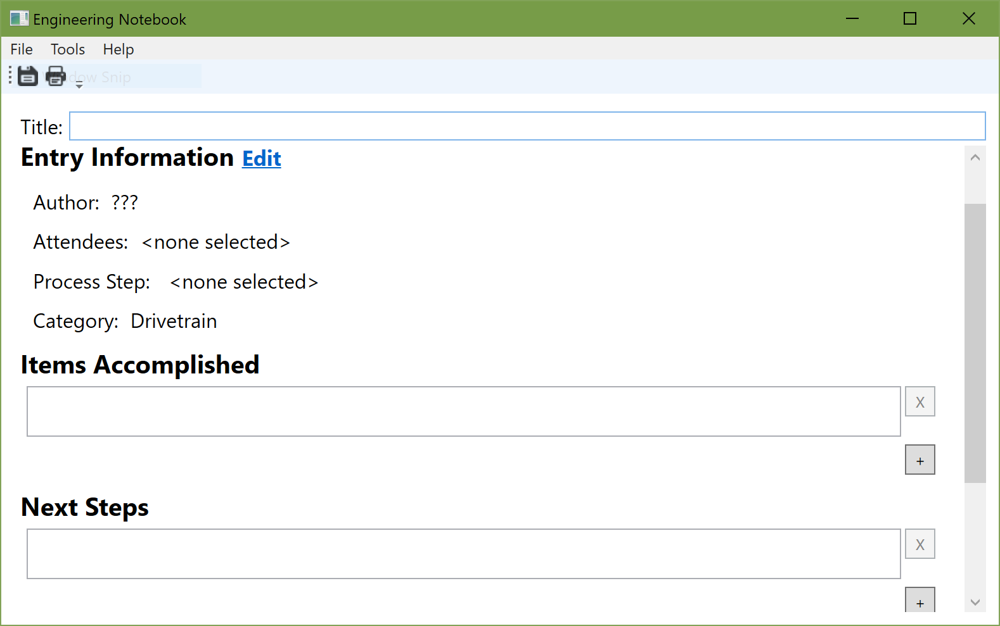

The following fields are presented to you for editing:

| Field              | Description                              |
| ------------------ | ---------------------------------------- |
| Title              | The title of the document as it appears when printed |
| Date               | The date of the session that this entry is documenting |
| Author             | The person who wrote the report          |
| Contributors       | Any other people that were present & assisted during the session that the entry is about |
| Process Step       | What topic(s) the entry is about         |
| Category           | What part of the robot the entries is about |
| Items Accomplished | What were the major accomplishments of entry's session |
| Next Steps         | What other things need to be accomplished after this session |
| Content            | The main content of the notebook that is composed of various *sections*.  See below for the types of *sections* that you can add. |
| Reflections        | Any additional comments about the entry in general |

## Section Types

The main body of the entry is composed of different types of content.  Each section is of a specific type, all of which are listed below.  

| Name             | Edit Mode                            | Print Mode                            |
| ---------------- | ------------------------------------ | ------------------------------------- |
| Section Title    | 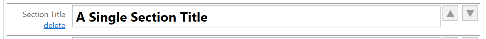         |          |
| Paragraph        |        |        |
| List             | 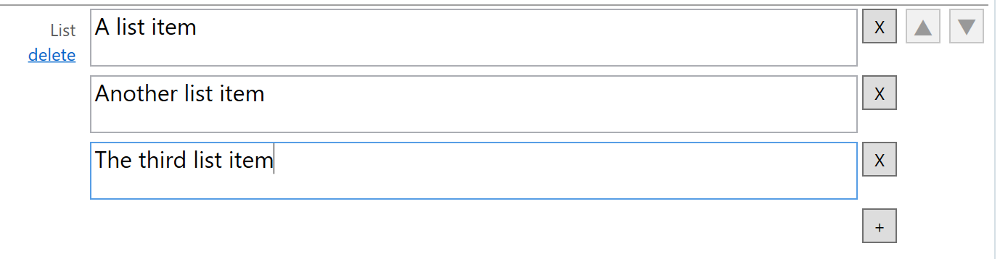            |             |
| Image (Large)    |       |       |
| Image & Blurb    |       |       |
| Image Collection |  |  |

## Previewing/Printing the Page

When you've edited the document and would like to either print it or preview what it will look like when printed, you can do so from the `File` menu:

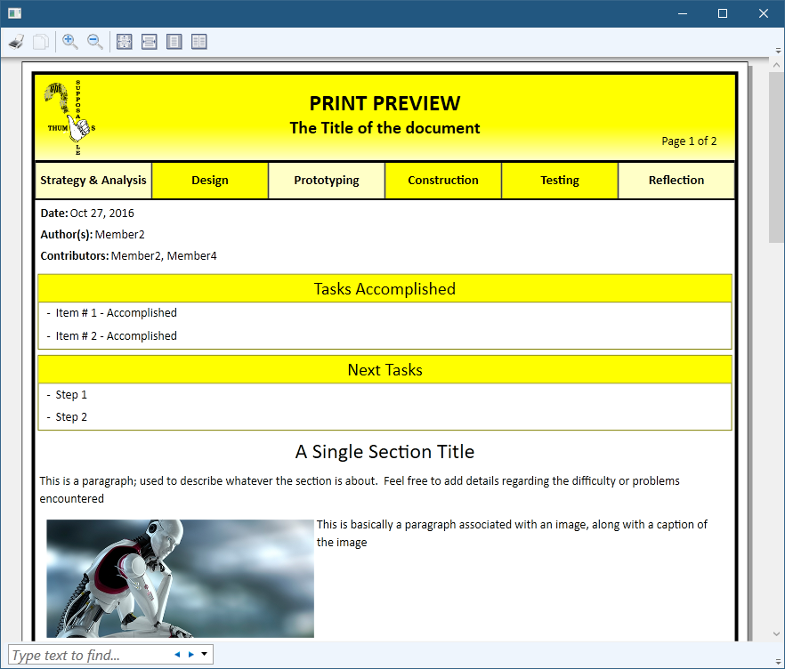

`Print Preview` will use a fake title, `Print w/Header` will ask you for the print title to use, so that you can number your entries for incorporation into the overall notebook.

## Editing Entry Information

The Author, Attendees, Applicable Process Steps, and Entry category are all editable via the `Edit` button next to the `Entry Information` header:

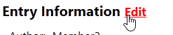

which then opens the entry information editor:

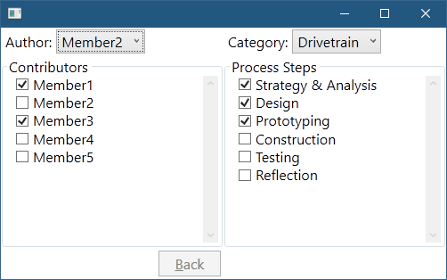

# Configuration File

The application configuration is a file that lives at `app-configuration.xml` next to the application.  If the file is not present when the app is started, a default file will be created.

The file determines what steps, categories, and team members are used within the app, and determines the appearance of some of the elements when printing.

## Example File

```
<Configuration>
  <Steps>
    <Step>Strategy &amp; Analysis</Step>
    <Step>Design</Step>
    ...
    <Step>Testing</Step>
    <Step>Reflection</Step>
  </Steps>
  <Members>
    <Member>Tim</Member>
    <Member>Nathan</Member>
    ...
    <Member>Andres</Member>
    <Member>Michael</Member>
  </Members>
  <Categories>
    <Category>Drivetrain</Category>
    <Category>Particle System</Category>
    ...
    <Category>Software</Category>
  </Categories>
  <Theme>
    <CategoryColor>#E4E2F4</CategoryColor>
    <CategoryColor>#FEDDDD</CategoryColor>
    ...
    <CategoryColor>#DEF5E8</CategoryColor>
    <!-- Page Colors -->
    <PrimaryColor>#FF99A1</PrimaryColor>
    <SecondaryColor>#FFD6D9</SecondaryColor>
  </Theme>
</Configuration>
```

There are 3 top-level nodes:

- `Steps`
- `Members`
- `Categories`
- `Theme`

## Configuration: `Steps`

This section contains one or more `Step` elements, each of which defines a new `Step` that is displayed along the top of the notebook:

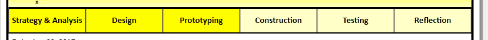

and selectable via the `Entry Information` dialog:

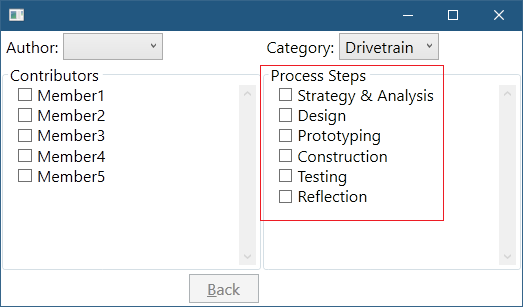


## Configuration: `Members`

This section contains one or more `Member` elements, each of which defines a team-member who is available from the `Author` editor and the `Contributors` list:

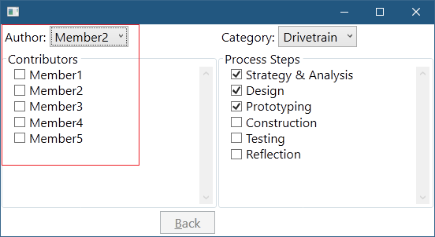

## Configuration: `Categories`

This section contains one or more `Category` elements, each of which defines a category that is displayed along the right of the entry:

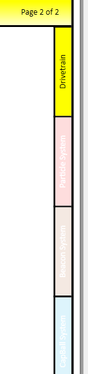

and selectable via the `Entry Information` dialog:

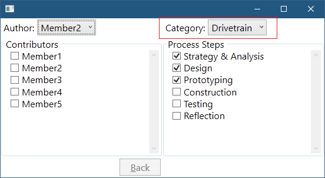

## Configuration: `Theme`

This section contains one or more `CategoryColor` elements, each of which defines a color (in hex format) to use for each of the categories along the right of the entry.

### Page Colors

This section also contains two properties for controlling the primary and secondary colors used when printing the page.  The primary color is specified with the `PrimaryColor` element, while the secondary color is specified in the `PrimaryColor`, both in hex format.

The primary color is used for the:

- Top of the page header, Top of of the page footer
- Tasks Accomplished
- Next Task boxes
- Selected Categories and Selected Steps

The secondary color is used for:

- The bottom of the page header, the bottom of the page footer
- Unselected steps

# Header Image

Place a 192x286 image, named `image.png` next to the executable and this image will be used in the header when printing the page.